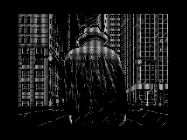
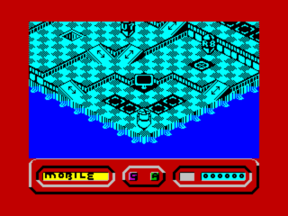
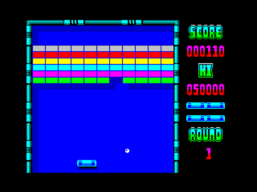

# rustzx
ZX Spectrum emulator which I writing in rust.   
I develop this project just for fun and for learning the basics of computer
architecture.  
Licensed under MIT License.

[](https://travis-ci.org/pacmancoder/rustzx)
## Features
- Written in pure rust  
- Cross-platform
- Documented source
- Full ZX Spectrum 48K and 128K emulation
- Perfect emulation of Z80 core
- Highly precise AY chip emulation with Ayumi library
- Beeper sound emulation
- Can handle tap, sna files
- Fast loading of tap files with standard loader
- Emulates border
- Kempston joystick emulation
- Correct contentons


## Current status [v0.8.x]
Preparing 0.8.x release

## Download [v0.7.1]
At the moment only `deb` package for amd64 available in releases section.
## Compiling
Before compiling make shure that **libportaudio** is
installed.  
On Ubuntu/Mint, for example you must to install packages **libportaudio2** and
**portaudio19-dev**  
On Arch/Manjaro you must install **portaudio** package

Then just install it with cargo (`~/.cargo/bin` must be in your **PATH**)

```bash
cargo install
```
For advenced info use `--help` flag

## How to use
Here some examples of usage:
```bash
rustzx --help
rustzx --fastload --tap test.tap
rustzx -f --128k --AY abc --tap test128.tap
rustzx --rom tester.rom --scale 3 --volume 50
```
For loading tape in 48K mode, press `j` then `Ctrl+p` twice, as on real Spectrum.
You must see `LOAD ""` on emulator's screen. And then press `Enter`.
If you `--fastload` option before launching, game will be launched, in other
case press `Insert` to insert tape. `Delete` can be used for ejecting tape from
tape reader. `--128k` flag launches emulator in 128K mode. For loading tape just
press `Enter`.

Use keys `F3 - F5` to set speed of emulation - this can be usefull when skipping some boring stuff.
Use `F6` to display FPS in window title. You can press `F2` for 64K memory
space dump.

## Screenshots

   


## Log
Watch [LOG](LOG.md) for details and github issues
for current plans and help requests.
## References
Of course, I used many resources to find out, how to build my first
emulator in life. So there is a list of useful references, from where I dig most information about Z80, ULA and other ZX Spectrum hardware parts:  
- Of course [z80.info](http://www.z80.info/)
    - [Decoding Z80 opcodes](http://www.z80.info/decoding.htm)
    - [Opcodes list](http://www.z80.info/z80code.txt)
    - [CPU user manual](http://www.z80.info/zip/z80cpu_um.pdf)
    - [CPU architecture](http://www.z80.info/z80arki.htm)
    - [Interrupt behaviour](http://www.z80.info/interrup.htm)
    - [Z80 undocumented documented](http://www.z80.info/zip/z80-documented.pdf)
- Instruction table from [ClrHome](http://clrhome.org/table/)
- "Floating bus explained!" by [Ramsoft](http://ramsoft.bbk.org.omegahg.com/floatingbus.html)
- 16K / 48K ZX Spectrum [Reference](http://www.worldofspectrum.org/faq/reference/48kreference.htm)
- 128K ZX Spectrum [Reference](http://www.worldofspectrum.org/faq/reference/128kreference.htm)
- [Z80 hardware organization](http://www.msxarchive.nl/pub/msx/mirrors/msx2.com/zaks/z80prg02.htm)
- [disassembler.io](https://www.onlinedisassembler.com) online disassembler
- Cool z80 assembler [zasm](http://k1.spdns.de/Develop/Projects/zasm-4.0/Distributions/)
- Diagnostic ROM by [Phill](http://www.retroleum.co.uk/electronics-articles/a-diagnostic-rom-image-for-the-zx-spectrum/)
- [zx-modules.de](http://www.zx-modules.de/) - great resource, check it out!
- [speccy.info](http://speccy.info)
- [Harlequin](http://www.zxdesign.info/harlequin.shtml)
- And many other great material, which helped me to make rustzx!
- [FUSE](http://fuse-emulator.sourceforge.net/) emulator source for finding out correct timings
## ROM's
Emulator contains ROM's, created by by Sinclair Research Ltd (now owned by Amstrad plc),
Amstrad was given permissions for distributing their ROM's with emulators, so they are
included in source of emulator (mod zx::roms). More about this read [here](https://groups.google.com/forum/?hl=en#!msg/comp.sys.amstrad.8bit/HtpBU2Bzv_U/HhNDSU3MksAJ)
